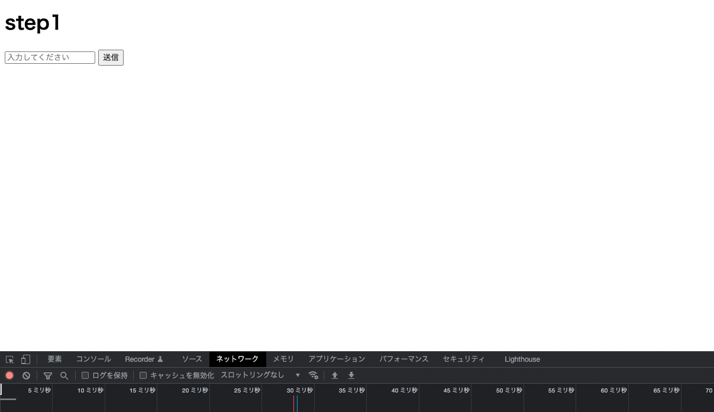

# Stage1 フロントエンド

バックエンドのapiができていると思います。
今回(step1)ではチャットbotとの1対1チャット機能をhttpリクエストを用いて開発していきます。

step1と2のフロントエンドは難しい技術はほとんど使わないので気楽にやっていきましょう。

フォルダの中(rootパス)にindex.htmlを用意してください。

### 仕様
* htmlファイル単一の構成である。
* チャットの履歴が更新されていく。
* 送信ボタンとテキスト入力欄がある。
* ページ遷移等はない。
* 入力したテキストは非同期でapiサーバに送信(http://localhost:8080/talk)

この仕様でチャレンジしてください。下に解説とコードを書いていきますが、仕様でチャレンジしてみたい人はチャレンジしてみてください。(できる人はReactやVue,svelte等を使ってもOKです)

```html
<!DOCTYPE html>
<head>
    <title>step1</title>
</head>
<body>
    <h1>step1</h1>
</body>
<script>
</script>
```

このように最初のコードを書いてください。
headタグの内は最低限にしています(今回はhtmlの勉強ではないので。)

次に**チャットのトークを表示する欄**と**送信ボタンとテキスト入力欄**を作成していきます

```html
<body>
    <h1>step1</h1>
    <div id="chat">

    </div>
    <input id="inputText" type="text" placeholder="入力してください">
    <button>
        送信
    </button>
</body>
```
これでUIの部分ができてきました。画像の感じになっていれば成功です。


#### 次に機能の部分(javascript)を書いていきましょう。
>**方針**
用意する関数は3つ
1.自分のメッセージをdomに反映させる関数
2.サーバから受け取ったメッセージをdomに反映させる関数
3.サーバとメッセージの送受信をする関数(非同期処理)

この方針にしたがって書いていきます。

1の関数を書く前に共通する定数を先に宣言しておきます
```javascript
const url = "http://localhost:8080/talk"
const chatSpace = document.getElementById("chat")
```
これでチャットを反映させるdomを指定しました。
urlを定義して、fetchでアクセスするurlも指定しておきます

では1つ目の関数を書いていきたいと思います。
```javascript
//msg=str,parentElem=dom
//自分のメッセージをdomに反映させる関数
function renderMyMsg (msg,parentElem) {
    let p = document.createElement('p')
    p.innerText = `私: ${msg}`
    parentElem.appendChild(p)
}
```
scriptタグ内にこの関数を書いてください。
この関数は文字列のmsgとdomのparentElementを引数として設定しています。
次に新しい新しいDOMとしてpを定義しました。pタグなので名前もpです。
pのテキストを```innerText```プロパティを用いて引数であるmsgの値に設定した後に、
parentelement最後の子要素として付け加えています。

これで一つ目の関数は終わりです。次に2つ目の関数を書いていきます。

```javascript
//msg=str,parentElem=nodem
//サーバからのレスポンスをdomに反映させる関数
function renderResponsedMsg(msg,parentElem) {
    let p = document.createElement('p')
    p.innerText =  `bot: ${msg}`
    parentElem.appendChild(p)
}
```

これは1つ目の関数とほとんど同じですが、innertextがbotと判定できるように変更されています。
> このように1部分しか変わっていない場合は一つの関数にするほうがベターですが、今回はわかりやすいように別の関数として定義しています。下に共通化させた場合の例を書いています。

``` JavaScript
//isBot = boolean
function exampleFunction(msg,paramElem,isBot) {
    let p = document.createElement("p")
    let txt = `私: ${msg}`
    if (isBot) txt = `bot: ${msg}`
    p.innerText = txt
    parentElem.appendChild(p)
}
```
最後に二つ目の関数を書いていきます。
>　**方針**
* JavaScriptの標準標準関数であるfethを仕様する(GETやPUT,PULLなどのリクエストを送れる関数)
* 関数1と関数2を呼び出す。
* 送信ボタンがクリックされたタイミングでこの関数が発火する
* inputの内部が空白だった場合に送信しない。

```javascript
async function sendMessage() {
    const inputText = document.getElementById('inputText')
    //何も入力しないとAPIがエラーを吐くのでここで防止。
    if (!inputText.value) {
        alert("文字を入力してから送信してください")
        return
    }
    //自分のメッセージをdomに反映
    renderMyMsg(inputText.value,chatSpace)
    //サーバが要求するqueryをjson形式で指定
    const query = {
        query:inputText.value
    }
    //fetchはデフォルトでgetリクエストのためのapiなのでpostやputにするときはメソッドを明示する必要がある。
    const method = "POST"
    //今回これはおまじない
    const headers = {
        'Accept': 'application/json',
        'Content-Type': 'application/json'
    };
    //bodyのjsonを送信のために文字列形式にする
    const body = JSON.stringify(query)
    //サーバにpostし、responseを受け取る。
    const response = await fetch(url,{method,headers,body})

    //ここでinputの内容を初期化
    inputText.value = ""

    //レスポンスをjsonに変換
    const json = await response.json()
    
    // https://a3rt.recruit.co.jp/product/talkAPI の形式でレスポンスが返されるので
    //今回必要な情報(reply)を指定して先ほど定義した関数に渡している。
    renderResponsedMsg(json.results[0].reply,chatSpace)        
    }
``` 
このような関数が出来上がります。
今回の関数はサーバーからの返答が同期ではない(少し時間がかかるので)非同期処理を書かないといけません。
その為```async```と```awati```を使用しています。
```async```は非同期関数であるという宣言で非同期関数はPromiseという型のデータを返すようになります。
また非同期関数の中ではawaitが実行されるまでそれ以降の処理が行われることがないのが特徴です。

最後にこの関数を発火するために送信ボタンにフラグを設定していきます。

```html
<button onclick="sendMessage()">
    送信
</button>
```
これで送信したタイミングで今まで定義した全ての関数が機能します。
サーバを起動してブラウザで試してみましょう。

### お疲れ様でした。これでstep1は終了です。