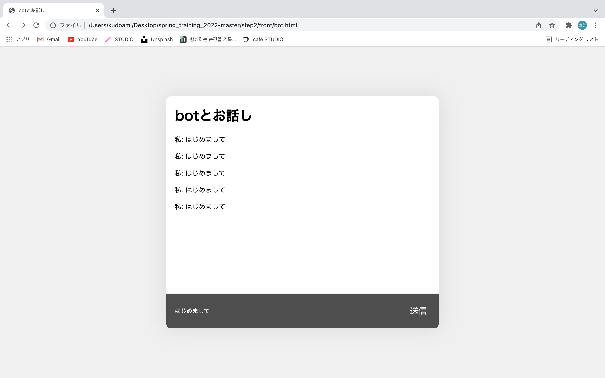

# step2 スタイリング
ここからはcssでスタイルを変更していきます。
cssが得意（好き）な人は、自由にスタイリングを行ってください。

まずは、bot.html / chatroom.htmlから変更していきます。
それぞれのhtmlファイルに
* container　（アプリ機能全体を覆うクラス）
* message　（入力部分以外の範囲を覆うクラス）
* input　（入力部分全体を覆うクラス）
* input-txt　（テキスト入力部分）
* inpu-btn　（送信ボタン部分）
<br>
のクラスを付与します。
<br>

#### bot.html
```html
<body>
    <div class="container">
        <div class="message">
            <h1>botとお話し</h1>
            <div id="chat">
            </div>
        </div>
        <div class="input">
            <input type="text" id="inputText" class="input-txt" placeholder="入力してください"/>
            <button onclick="sendMessage()" class="input-btn">
                送信
            </button>
        </div>
    </div>
</body>
```
<br>

#### chatroom.html
```html
<body>
    <div class="container">
        <div class="message">
            <h1>オープンチャットルーム</h1>
            <input type="text" id="name" placeholder="ニックネームを設定"/>
            <button id="setName" >設定</button>
            <h3 id="nameArea"></h3>
            <div id="chatSpace"></div>
        </div>
        <div class="input">
            <input type="text" id="message" class="input-txt" placeholder="メッセージを入力" disabled>
            <button id="send" class="input-btn" onclick="" disabled>送信</button>
        </div>
    </div>
</body>
```

<br>
また、head内に<link rel="stylesheet" href="style.css"/>を記述し、スタイルシートが反映されるように設定してください。


<br>
それでは、style.cssを作成し、cssを書いていきましょう。


```CSS
body {
    margin: 0 auto;
    height:100vh;
    background-color: #f0f0f0;
    display: flex;
    justify-content: center;
    align-items: center;
}
```

まずは、bodyを変更します。
ブラウザによって、デフォルトでbodyにmarginが付与されていることがあるので、0に設定して余白を無くします。
heightは、画面いっぱいに表示されるよう100vhに設定します。
`display/justify-content/align-items`を以下のように記述することで、body内にあるdivの要素が上下左右中央に配置されます。
<br>


```CSS
.container{
    width:45%;
    height:70%;
    position: relative;
    background-color: white;
    box-shadow: 0 0 50px  rgba(0, 0, 0, 0.1);
    border-radius: 10px;
    overflow: hidden;
}

.message{
    width: 100%;
    height:85%;
    overflow: scroll;
    padding: 0 20px;
}

.input{
    width: 100%;
    height: 15%;
    background-color: #4e4e4e;
    position: absolute;
    left:0;
    bottom: 0;
    display: flex;
    justify-content: space-between;
}
```

全体の設定が完了したので、次に機能部分の設定を行います。
<br>
アプリ機能全体を覆うcontainerクラスは親要素（body）に対して縦45%、横70%に設定します。
メッセージの表示部分とテキストの入力部分は親要素（container）に対して85対15の比率にします。（width:85%, width:15%）
<br>
次にinputクラスを細かく調整していきます。
私たちが普段利用するチャットアプリの様に、テキスト入力の部分は画面下に固定したいので、positionというプロパティを使用してinputの部分を固定していきます。

containerクラスを`relative`、inputクラスを`absolute`とし、`bottom:0`で、下からの距離を0にすることでcontainerクラス内の最下部にテキスト入力部分が固定されるようになります。
<br>
入力部分と送信ボタンの要素は親要素（input）内の両サイドに配置したいので、以下のように記述しています。
```CSS
    display: flex;
    justify-content: space-between;
```

<br>
最後にテキスト入力画面部分と送信ボタンの細かい設定を以下のように行います。

```CSS
.input-txt, .input-btn{
    border: none;
    background-color: transparent;
    height:100%;
    color: white;
    padding: 0 20px;
}

.input-txt{
    width:80%;
    font-size: 14px;
}

.input-txt:focus{
    outline: none;
}

.input-btn{
    width:15%;
    font-size: 20px;
}
```

ここで記述されている`.input-txt:focus`の`focus`とは、CSSの疑似クラスで、主にフォーカスできる（入力フォームのような）要素に対して使用することができるものです。
今回はテキスト入力時に水色の線が表示されるのを無効化しています。

### これでstage2は終了です。


### 完成図はこんな感じです

